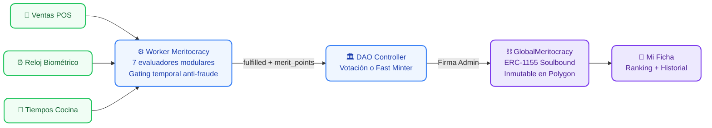
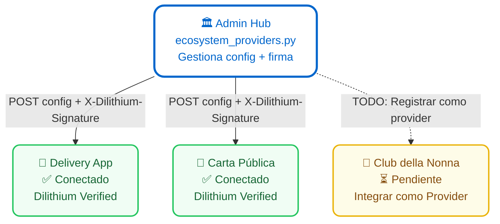
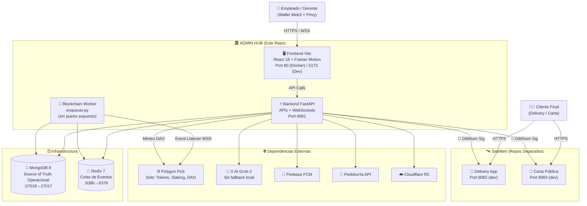

# 🍝 Vanellix Admin Hub — La Piccola Italia


> **Panel administrativo Web3-Hybrid para La Piccola Italia. Arquitectura de doble fuente de verdad: MongoDB para operaciones en tiempo real (pedidos, chat, marketing) y 14 Smart Contracts desplegados en Polygon PoS para gobernanza DAO, tokenización, staking, meritocracia y exchange descentralizado.**

🌐 **Producción:** [testing.lapiccolaitalia.cl](https://testing.lapiccolaitalia.cl)

---

## 📋 Qué Es y Qué No Es (Sin Humo)

| Afirmación | Realidad |
|------------|----------|
| "Web3" | ✅ **Sí, Hybrid.** 14 contratos Solidity desplegados en Polygon PoS con direcciones reales: DAO Controller, Staking Multi-Token, GlobalMeritocracy, TokenFactory, Uniswap V2 (Router+Factory), Redemption, Launchpad V1/V2. La identidad, gobernanza, tokens y meritocracia **sí viven on-chain**. |
| "Descentralización total" | ⚠️ **Parcial (por diseño).** Las operaciones de alta velocidad (pedidos delivery, chat, marketing) usan MongoDB porque la chain no puede servir lecturas a 50ms. Es una decisión pragmática, no una limitación. Los datos financieros críticos (tokens, staking, votación) sí son inmutables on-chain. |
| "Backend stateless" | ❌ **No.** El backend es stateful (MongoDB + Redis). Esto es correcto para el throughput operacional de un restaurante real. |
| Dilithium post-cuántico | ✅ **Sí, con trade-offs aceptados.** Firmas de ~2.5KB y verificación más lenta que Ed25519. Lo elegimos porque `dilithium-py` ya estaba integrado para la custodia de mnemonics (BIP39), así que reutilizamos el primitivo para firma inter-servicio. El overhead es aceptable para la frecuencia de sync (pocos requests/minuto). |
| XAI Grok-2 como motor IA | ✅ **Dependencia externa fuerte.** Si X.AI se cae, La Nonna responde "Estoy ocupado" (fallback graceful). No hay modelo local de respaldo. Deuda técnica conocida; plan B futuro: Ollama/Llama self-hosted. |
| Tests de Smart Contracts | ✅ **Sí.** Suite Hardhat completa en `Vanellix_DEX_3.0/` con simulación timeline (0→1→2→6→12→18 meses). Coverage report, gas report y auditoría PDF. Los 14 contratos están testeados. |
| Tests de Backend (Python) | ⚠️ **No hay suite automatizada**, pero el sistema lleva **+1 año en producción real** operando restaurantes con pedidos, delivery, pagos Transbank, chat con clientes y meritocracia on-chain. Battle-tested con usuarios reales, no en un laboratorio. La deuda es no tener tests automatizados para regresión, no falta de validación. |

### 🔗 Los 14 Contratos Desplegados (Polygon PoS)

| Contrato | Dirección | Función |
|----------|-----------|---------|
| `VanellixDAOController` | `0x7AbD...581c` | Gobernanza DAO: propuestas, votación, ejecución |
| `VanellixCompanyMultiToken` | `0x5A21...7de9` | Tokens ERC-1155 de la empresa (PAZ, PARE, Méritos) |
| `VanellixStakingMultiToken` | `0x7dBC...5C0d` | Staking gamificado: depositar tokens, ganar rewards |
| `GlobalMeritocracy` | `0xe75e...AaaC` | Meritocracia on-chain: KPIs → Tokens inmutables |
| `VanellixTokenFactory` | `0x826a...62Bd` | Fábrica de tokens: crear nuevos segmentos ERC-1155 |
| `VanellixLaunchpad` V1/V2 | `0xECe6...A78` | Launchpad de distribución inicial de tokens |
| `VanellixTokenSale` | `0xaaDB...D9E9` | Venta de tokens a empleados/clientes |
| `VanellixRedemption` | `0xFd2E...A6B5` | Canje de tokens por beneficios reales |
| `UniswapV2Factory` | `0x3E6b...Bd20` | Exchange descentralizado: creación de pares |
| `UniswapV2Router02` | `0x2741...Fd01` | Exchange descentralizado: swaps de tokens |
| `CompanyStaking` | `0x138c...7c86` | Staking específico por empresa |
| `SimpleWalletMinting` | `0x38fF...CB5b` | Minteo rápido sin pasar por DAO (Fast Minter) |
| `WrappedToken` | `0xf631...0C21` | Token envuelto (PAZ wrapped) |
| `WrappedUtilityToken` | `0x7ed2...e6C4` | Token de utilidad envuelto (PARE wrapped) |

> El backend conecta a estos contratos via **multi-RPC failover** (Alchemy → Polygon → Infura) con caching inteligente de `eth_chainId` y `eth_blockNumber` para minimizar requests.

---

## 🏆 Flagship Feature: Meritocracia con Soulbound Tokens

Este es el sistema más innovador del proyecto y, hasta donde sabemos, **único en el mundo para la industria gastronómica**: un pipeline completo que mide KPIs laborales reales y los convierte en tokens Soulbound inmutables on-chain.



### ¿Por qué es único?

| Característica | Detalle |
|----------------|---------|
| **Datos reales, no auto-reportados** | Los KPIs vienen del POS (ventas), el reloj biométrico (asistencia) y el KDS (tiempos de cocina). No hay input manual del empleado ni del jefe. |
| **7 evaluadores modulares** | Ranking de ventas, top por categoría, asistencia perfecta, tiempos operacionales por empleado y por local. Cada uno es un archivo Python independiente que el worker descubre automáticamente. |
| **Gating temporal (anti-fraude)** | Las reglas mensuales solo se evalúan cuando el mes cerró. Las anuales solo en diciembre del año cerrado. Nadie puede manipular datos de un período abierto. |
| **Scope dinámico** | Cada regla filtra por sección (Cocina, Salón) y cargo (Garzón, Chef) usando la asistencia real del período, no la ficha estática. Un cambio de cargo retroactivo no altera resultados históricos. |
| **Soulbound = Inmutable** | Una vez minteado, el token existe para siempre en Polygon. No puede ser transferido, borrado ni falsificado. Es un currículum laboral verificable on-chain. |
| **Gas despreciable** | Polygon PoS: ~$0.001-0.01 USD por TX. Costo mensual para 50+ empleados: ~$1-5 USD. |

> 📖 **Documentación técnica completa:** [`config/gamification/README.md`](./backend/config/gamification/README.md)

---

## 🎁 Economía de Tokens: Canje Real de Beneficios

Los tokens que ganan los empleados **no son decorativos**. El sistema de Promociones (`Promotions.jsx`) permite canjear tokens por beneficios reales del restaurante. El empleado elige una promoción, el sistema verifica su balance on-chain, y si tiene suficientes tokens, genera un cupón canjeable en cualquier sucursal.

**Tipos de tokens aceptados como pago:**

| Token | Contrato | Uso en Promociones |
|-------|----------|--------------------|
| **PAZ** (Gobernanza) | `WrappedToken` | Canjear por descuentos, experiencias VIP, votación de menú |
| **PARE** (Utilidad) | `WrappedUtilityToken` | Generados por staking de PAZ. Canjear por cupones diarios |
| **Méritos Soulbound** | `GlobalMeritocracy` (ERC-1155) | El mejor vendedor del mes puede canjear su token de mérito por un beneficio exclusivo |

El sistema cruza `tokenBalances` (PAZ/PARE on-chain), `meritBalances` (Soulbound ERC-1155) y `burnBalances` (tokens ya quemados en canjes anteriores) para determinar en tiempo real qué puede canjear cada empleado.

### 📊 Adopción Real: 5,000+ Wallets Creadas

El onboarding Web3 fue invisible gracias a **Privy**. Los empleados y clientes se registraron con email o Google, y Privy les creó una wallet Polygon embebida automáticamente. **Ninguno de los 5,000+ usuarios necesitó saber qué es una wallet, un token o una blockchain**. Simplemente usan el sistema como una app normal, y la criptografía ocurre debajo.

---

## 🛰️ Gestión de Satélites: El Patrón Ecosystem Provider

¿Por qué Dilithium? Porque este no es un sistema de 1 servidor. El Hub administra **múltiples satélites** como si fueran contratos desplegados en una blockchain:



### ¿Cómo funciona `ecosystem_providers.py`?

1. **Registro:** Cada satélite se registra en MongoDB con su URL, su clave Dilithium y su estado.
2. **Sync con Firma:** Cuando el Admin cambia una configuración (ej: credenciales de Transbank, API keys, menú), el Hub serializa el payload, lo firma con Dilithium (`sign_with_mnemonic`), y lo envía al satélite vía HTTP POST con cabeceras `X-Dilithium-*`.
3. **Verificación:** El satélite verifica la firma post-cuántica antes de aceptar la configuración. Si la firma no coincide → reject instantáneo. No hay forma de inyectar config falsa.
4. **Este patrón es idéntico a un despliegue de contrato inteligente:** El Hub "despliega" configuración firmada, y el satélite la ejecuta solo si la firma es válida. La diferencia es que opera sobre HTTP en vez de EVM.

### 🎰 Pendiente: Club della Nonna como Provider

El sitio de testing (`testing.lapiccolaitalia.cl`) actualmente corre como un proyecto independiente. El objetivo es registrarlo como un **Ecosystem Provider** más, igual que Carta y Delivery, para que:
- Reciba configuraciones firmadas via Dilithium
- Sincronice tokens, promociones y catálogo automáticamente
- Se gestione desde el mismo panel administrativo

---

## 🏗️ Arquitectura Real: Hub-and-Spoke



---

## 🐳 Docker Compose: Secuencia de Arranque

| Orden | Servicio | Imagen | Puerto Host | Puerto Contenedor | Depende de |
|:-----:|----------|--------|:-----------:|:-----------------:|------------|
| 1 | `mongo` | `mongo:8` | `27018` | `27017` | — |
| 2 | `redis` | `redis:7` | `6380` | `6379` | — |
| 3 | `backend` | Build local | `8081` | `8081` | mongo, redis |
| 4 | `vanellix-worker` | Build local | ninguno | — | mongo, redis |
| 5 | `frontend` | Build local (Nginx) | `8082` | `80` | backend |

> ⚠️ **Conflicto de puertos en desarrollo local:** En dev sin Docker, el Backend Admin corre en `:8081`, Delivery en `:8082`, y Carta en `:8083`. En Docker, el Frontend Admin usa `:8082` como host port. **No levantes Docker y dev local simultáneamente** sin cambiar `FRONTEND_HOST_PORT`.

**Producción (Docker):**
```bash
docker compose up -d
```

**Desarrollo local (sin Docker):**
```bash
# Terminal 1: Backend Admin Hub
cd backend && source venv/bin/activate
uvicorn main:app --host 0.0.0.0 --port 8081 --reload

# Terminal 2: Frontend Admin Hub
cd frontend-vite && npm run dev
```

---

## 🧠 Los 5 Motores Internos

| Motor | Ubicación | Función | Dependencia Externa | Fallback |
|-------|-----------|---------|:-------------------:|----------|
| 👵 **La Nonna** | `utils/bot/engine.py` | IA conversacional. Rutea intenciones, extrae filtros NLP, sintetiza datos. | X.AI Grok-2 | ❌ No hay. Si XAI cae, el chat devuelve "Estoy ocupado". |
| ⚙️ **Automation** | `services/automation_engine.py` | Disparadores Push/Mail por eventos. | Firebase FCM | ⚠️ Si FCM falla, el evento se pierde (no hay retry queue). |
| 🎮 **Gamification** | `config/gamification/` + `utils/kpis/` | Meritocracia Soulbound: 7 evaluadores KPI → Gating temporal → Batch Mint → ERC-1155 inmutable via DAO. | Polygon PoS RPC | ✅ Multi-RPC failover (Alchemy → Infura → Public). |
| 🔐 **Dilithium** | `utils/vanellix_crypto.py` | Firmas post-cuánticas Hub↔Satélites. | Ninguna (local) | ✅ Auto-contenido. |
| 🔄 **Enqueuer** | `utils/enqueuer.py` | Listener de eventos Polygon → Redis. | Polygon WSS | ⚠️ Si el worker muere, eventos se pierden hasta restart. |

### Costos de Gas (Gamification On-Chain)

La empresa paga el gas directamente desde una wallet operacional (`PRIVATE_KEY_WALLET`). No usamos meta-transactions ni ERC-2771. El flujo es:

1. Admin planifica el batch de méritos del mes (`plan_batch_merit`).
2. El backend construye las TXs (`build_batch_txs_via_dao`).
3. El Admin firma desde el Frontend con su Wallet (Privy embedded).
4. El gas lo paga la wallet del Admin o el Fast Minter designado.
5. Con Polygon PoS el gas es de ~$0.001-0.01 USD por TX, así que el costo mensual es despreciable (~$1-5 USD para 50+ empleados).

---

## 🔒 Capas de Seguridad

| Capa | Mecanismo | Protege | Debilidad Conocida |
|------|-----------|---------|-------------------|
| **Identidad** | Privy JWT + Wallet Signature | Autenticación del empleado | Si Privy se cae, nadie puede loguearse. |
| **Autorización** | RBAC 7 niveles | Permisos por cargo | Los niveles se cachean 5 min; un cambio de rol tarda en propagarse. |
| **Transporte** | Dilithium Signatures | Hub ↔ Satélites | Firmas de 2.5KB por request. Overhead aceptable pero no óptimo. |

---

## 🔧 Operaciones (Lo Aburrido Importante)

### Rotación de Claves Dilithium
```bash
# 1. Generar nuevo mnemonic encriptado
python -c "from utils.vanellix_crypto import generate_new_keypair; generate_new_keypair()"

# 2. Actualizar el campo dilithium_mnemonic_enc en MongoDB para el provider
# 3. Re-sincronizar la config a los satélites (POST /api/delivery/config/push-to-providers)
# 4. Los satélites aceptarán la nueva clave en el siguiente sync
```

### ¿Qué pasa si el Worker (Enqueuer) se cae?
Los eventos blockchain emitidos durante el downtime **se pierden**. No hay replay desde la chain implementado. El worker debe estar monitoreado y con `restart: unless-stopped` en Docker (ya configurado).

**Mitigación futura:** Implementar un checkpoint de `block_number` en Redis para poder hacer replay desde el último bloque procesado.

### ¿Qué pasa si MongoDB se corrompe?
No hay backups automatizados configurados en este repo. Los datos operacionales (pedidos, empleados, méritos calculados) viven exclusivamente en MongoDB.

**Recomendación:** Configurar `mongodump` con cron externo o usar MongoDB Atlas con backups automáticos en producción.

### ¿Qué pasa si XAI cambia pricing o se cae?
La Nonna deja de responder inteligentemente. El fallback actual devuelve un mensaje genérico ("Estoy ocupado"). El chat de Delivery seguiría funcionando para mensajes de texto plano (admin→cliente), pero la IA no participaría.

---

## 📁 Estructura y Documentación Detallada

Cada módulo tiene su propio README. Haz clic para profundizar:

```
piccola_italia_admin_web3/
│
├── 📄 README.md                          ← Estás aquí
├── 🐳 docker-compose.yml                 ← 5 servicios orquestados
│
├── ⚡ backend/
│   ├── 📄 README.md                       ← Engines, Mandatos, Diagrama interno
│   ├── 🛣️ apis/README.md                  ← Clean API Mandate & RBAC
│   ├── 👵 utils/bot/README.md             ← La Nonna AI (Grok-2 Router)
│   ├── ⚙️ services/automations/README.md  ← Automation Engine (Push/Mail)
│   └── 🎮 config/gamification/README.md   ← Meritocracia Web3 & DAO
│
├── 🖥️ frontend-vite/
│   ├── 📄 README.md                       ← Frontend Architecture & UI
│   └── src/
│       ├── 🧩 components/README.md        ← Layout Shell & ContentWrapper
│       ├── 📄 pages/README.md             ← Auto-Discovery & pagesConfig
│       └── 🪝 hooks/README.md             ← Hooks & Refactor Pendiente
```

---

## 🌱 Variables de Entorno

- **Backend:** `backend/.env.example` — MongoDB, Web3 RPCs, Privy, XAI, Firebase, R2, Transbank
- **Frontend:** `frontend-vite/.env.example` — Privy App ID, API URL, Chain Config, VAPID Key
- **Docker Root:** Variables inline en `docker-compose.yml` — Puertos, credenciales Mongo/Redis

> ⚠️ **Nunca subas archivos `.env` al repositorio.**

---

## 🚚 Ecosistema Completo

| Servicio | Puerto (Dev) | Puerto (Docker) | Repositorio |
|----------|:------------:|:----------------:|-------------|
| 🏛️ Admin Hub Backend | `8081` | `8081` | Este repo |
| 🏛️ Admin Hub Frontend | `5173` | `8082` | Este repo |
| 🛵 Delivery Backend | `8082` | — | `delivery-piccola/` |
| 🛵 Delivery Frontend | `5174` | — | `delivery-piccola/` |
| 📖 Carta Backend | `8083` | — | `carta-piccola/` |
| 📖 Carta Frontend | `5175` | — | `carta-piccola/` |

---

## 📋 Estado de Tests y Deuda Técnica

### ✅ Lo que SÍ está testeado
- [x] **Smart Contracts (Hardhat):** Suite timeline completa en [`Vanellix_DEX_3.0/test/`](../Vanellix_DEX_3.0/test/) que simula 18 meses de operación del ecosistema: deploy → roles → staking → DAO governance → token sale → redemption → Uniswap swaps. Con 110+ wallets de prueba, coverage report (`coverage/`), gas report y auditoría PDF (`reports/`).
- [x] **Slither Analysis:** Análisis estático de seguridad generado (`slither-output.json`).
- [x] **Backend (producción):** +1 año operando restaurantes reales. Battle-tested con usuarios, pagos Transbank y meritocracia on-chain.

### ❌ Deuda Técnica Pendiente
- [ ] **Tests Backend (Python):** No hay suite automatizada de regresión. El sistema está validado en producción, pero falta la red de seguridad para cambios grandes.
- [ ] **Fallback IA:** Si XAI muere, no hay modelo local de respaldo.
- [ ] **Retry Queue (Automation):** Si FCM falla al enviar un push, el evento se pierde.
- [ ] **Blockchain Replay (Worker):** Si el enqueuer se cae, los eventos on-chain se pierden.
- [ ] **Hooks Refactor (Frontend):** ~60 hooks sueltos en la raíz pendientes de organizar por dominio.

---

## 🚀 Deploy y Resiliencia de Datos

### Pipeline de Deploy: Git → Coolify
Los deploys a producción se gestionan a través de **Coolify**, que controla las subidas por commit:

```
git push origin main → Coolify detecta commit → Build automático → Deploy controlado
```

No hay deploy manual ni SSH directo a producción. Todo pasa por Git y Coolify lo orquesta.

### Resiliencia por Capas

| Capa | Fuente de Verdad | Backup | Riesgo |
|------|-------------------|--------|--------|
| **Finanzas / Ventas** | Sistema POS externo | ✅ Backups propios del POS. El Hub solo consume, no es source of truth. | Ninguno |
| **Tokens / Staking / DAO / Méritos** | Polygon PoS (14 contratos) | ✅ Inmutables on-chain. No se pueden perder. | Ninguno |
| **Admin Hub** (chat, KDS, carriers, config, reviews) | MongoDB en server Admin | ✅ Coolify backup completo del VPS (Mongo incluido). | Bajo |
| **Delivery** (pedidos, vendedores, sync) | MongoDB en server Delivery | ✅ Coolify backup completo + re-sync Dilithium desde Admin Hub. | Bajo |
| **Config de satélites** | Regenerable desde Admin Hub | ✅ `ecosystem_providers.py` re-pushea config firmada. | Ninguno |

### Dilithium como Mecanismo de Re-Sync

Dilithium no es solo seguridad — es **redundancia funcional**. Si un satélite (Delivery, Carta) se cayera completamente y se restaurara desde un backup limpio, el Admin Hub puede re-pushear toda la configuración firmada con un solo POST a `/api/delivery/config/push-to-providers`. El satélite verifica la firma, acepta la config y queda operativo. No necesita setup manual.

### Peor Caso Real (Disaster Recovery)

Si el VPS se cae entre backups de Coolify:
- **Pedidos en curso:** Recuperables contactando clientes (minutos de datos, no horas).
- **Chat:** Se reabre. El historial perdido es solo lo posterior al último backup.
- **Méritos del mes:** Se recalculan desde el POS con `python -m utils.kpis.worker_meritocracy --periodo YYYYMM`. Los datos fuente (ventas, asistencia) vienen del POS, no de MongoDB.
- **Tokens on-chain:** Intactos. La blockchain no se cae.
- **Config de satélites:** Re-sync Dilithium desde el Hub.

> 💡 **Recomendación pendiente:** Hacer un drill de restore de backup Coolify a un VPS de prueba para validar empíricamente que Mongo vuelve completo. Una tarde, sin presión.

---

## 🤝 Autor

- **Arquitecto:** Lucciano Vanella ([luccianoVanella](https://github.com/luccianoVanella))
- **Contacto:** lucciano@vanellix.com
