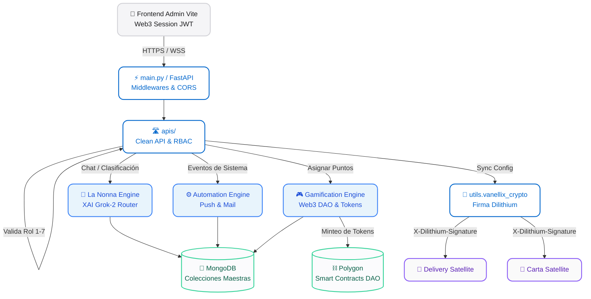

# 🌌 Vanellix Admin Hub: El Núcleo de Orquestación

Bienvenido al corazón tecnológico de La Piccola Italia. El **Admin Hub** no es una simple API; es el cerebro maestro que coordina, autentica y enruta todas las operaciones de la cadena, desde el despacho de pizzas hasta la inteligencia artificial y la gamificación de los empleados.

Diseñado bajo una estética de arquitectura limpia y descentralizada, este backend opera con un modelo **Hub-and-Spoke**, siendo la única fuente de la verdad para todos los ecosistemas satélites (Carta Pública, Aplicación de Repartidores, Sistema POS).

---

## 📐 Arquitectura del Sistema (Diagrama de Flujo)

El siguiente diagrama ilustra cómo fluye la información a través del Hub, aplicando la **Zero-Trust Security** (Autenticación Web3 + Dilithium) y delegando tareas complejas a Motores Especializados.

---

## 📚 Ecosistema de Documentación

Para mantener el código escalable, hemos dividido la documentación en "Módulos de Dominio". Si quieres modificar algo específico, **lee el README de esa carpeta primero**:

- 🛣️ **[APIs & Controladores (`apis/README.md`)](./apis/README.md)**: Reglas de enrutamiento, validación de Roles (RBAC) y el mandato estricto de "APIs Limpias sin lógica de negocio".
- 👵 **[La Nonna AI Engine (`utils/bot/README.md`)](./utils/bot/README.md)**: El Router dictatorial LLM. Entiende cómo Grok filtra entidades, decide intenciones y habla con el cliente.
- ⚙️ **[Automation Engine (`services/automations/README.md`)](./services/automations/README.md)**: Disparadores en tiempo real (FCM Push / Mail) basados en eventos (Pedido Entregado, etc).
- 🎮 **[Meritocracia Soulbound (`config/gamification/README.md`)](./config/gamification/README.md)**: El sistema flagship. Un worker batch evalúa 7 tipos de KPIs reales (ventas POS, asistencia biométrica, tiempos de cocina) con gating temporal anti-fraude, y los resultados se mintean como tokens ERC-1155 Soulbound inmutables en Polygon vía la DAO o el Fast Minter. Los empleados tienen un currículum laboral on-chain verificable que nadie puede falsificar.
- 📊 **KPI Worker (`utils/kpis/worker_meritocracy.py`)**: El proceso batch que alimenta la meritocracia. Carga dinámicamente evaluadores de `config/gamification/rules_models/`, resuelve elegibilidad por asistencia real del período, aplica scope por sección/cargo, y genera resultados `fulfilled`/`not_fulfilled` con `merit_points` y `segment_token_id`.

---

## 🏛️ Mandatos Fundamentales (Los 4 Pilares)

Todo código que se escriba en este repositorio **debe** obedecer los siguientes mandatos:

### 1. Mandato de Frontera de Negocio (Clean API)
Ninguna función en `apis/` puede superar las ~50 líneas. Si tu ruta necesita calcular algo complejo, delega el trabajo a una carpeta especializada (`services/` o `config/`). La API solo valida entrada, revisa permisos y devuelve JSON.

### 2. Mandato Temporal (Chile Time Authority)
Todo cálculo de fechas, agendamientos o reportes financieros debe usar `get_chile_time()` de `utils.time_utils`. Queda **estrictamente prohibido** el uso de `datetime.utcnow()` para prevenir desincronizaciones de facturación.

### 3. Mandato de Autenticación Criptográfica (Dilithium)
La comunicación cruzada con satélites (Carta, Delivery) ya no confía en contraseñas o API Keys en texto plano. Toda petición HTTP interna debe estar firmada y validada asimétricamente usando las cabeceras `X-Dilithium` (`utils.vanellix_crypto.py`).

### 4. Mandato de Resiliencia del Loop (Non-Blocking)
Las llamadas a la Blockchain (RPC) y a la Inteligencia Artificial (Grok) son lentas. Todo proceso en estos motores debe estar envuelto en un `_with_timeout()` o ejecutarse mediante workers en segundo plano para jamás bloquear el *Event Loop* principal de FastAPI.

---

## 🛠️ Arranque del Servidor

1. Clona el archivo base de variables de entorno:
   \`\`\`bash
   cp .env.example .env
   \`\`\`
2. Configura tus llaves maestras en `.env` (MongoDB, XAI API, Web3Auth, etc).
3. Levanta el núcleo en el puerto designado:
   \`\`\`bash
   uvicorn main:app --host 0.0.0.0 --port 8081 --reload
   \`\`\`

> *“Simplicity is the ultimate sophistication.”* – Filosofía de diseño de Vanellix.
