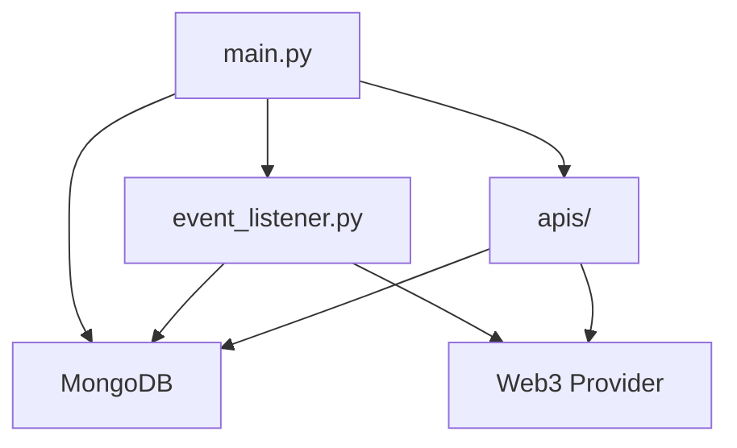

# La Piccola Italia Backend — Club della Nonna


> **Backend API y eventos Web3 para el Club della Nonna — La Piccola Italia.**
> Loyalty, gamificación y Web3 para la comunidad más sabrosa de Chile.

---

## 🗂 Tabla de Contenidos
- [Visión General](#visión-general)
- [Stack Tecnológico](#stack-tecnológico)
- [Arquitectura Visual](#arquitectura-visual)
- [Onboarding Rápido](#onboarding-rápido)
- [Variables de Entorno](#variables-de-entorno)
- [Comandos Útiles](#comandos-útiles)
- [Principales Endpoints](#principales-endpoints)
- [Flujo de Eventos Blockchain](#flujo-de-eventos-blockchain)
- [Testing y Cobertura](#testing-y-cobertura)
- [Despliegue & CI/CD](#despliegue--cicd)
- [Troubleshooting](#troubleshooting)
- [Seguridad y Buenas Prácticas](#seguridad-y-buenas-prácticas)
- [Contribución](#contribución)
- [Contacto & Créditos](#contacto--créditos)

---

## 🚀 Visión General
Backend modular, seguro y escalable para el Club della Nonna — La Piccola Italia. Expone APIs RESTful y workers de eventos blockchain para el programa de lealtad, gamificación y comunidad Web3 de La Piccola Italia. Incluye autenticación Web3 (Privy), lógica de recompensas, gestión de membresías, integración con la tienda y persistencia en MongoDB. Arquitectura lista para microservicios, despliegue cloud y escalabilidad para toda la comunidad Piccola.
---

## ⚡️ Puerto Dinámico y Modularidad
- El backend escucha en el puerto definido por la variable de entorno `PORT` (por defecto 8081).
- Todos los endpoints de negocio se cargan automáticamente desde la carpeta `/apis` y se montan bajo el prefijo `/api`.
- La documentación Swagger UI está disponible en `/api/docs`.

---

## 🔐 Autenticación y Sesión (Privy)
- **Login:** `POST /api/login` — Recibe JWT de Privy y wallet, valida y crea sesión en MongoDB.
- **Verificación:** `POST /api/verify` — Verifica JWT y wallet.
- **Formato de sesión:** Guarda wallet, sub, exp, iat, sid.

---

## 🚦 Despliegue y Ejecución

### Manual (desarrollo)
```sh
cd backend
python3 -m venv venv && source venv/bin/activate
pip install -r requirements.txt
export PORT=8081  # O el puerto que quieras
uvicorn main:app --host 0.0.0.0 --port $PORT
```

### Docker
```sh
docker build -t vanellix-backend .
docker run -d --env PORT=8081 -p 8081:8081 vanellix-backend
```

### Docker Compose
Define en tu `.env`:
```
BACKEND_PORT=8081
```
Y en tu `docker-compose.yml`:
```yaml
backend:
  build:
    context: ./backend
  environment:
    - PORT=${BACKEND_PORT}
  ports:
    - "${BACKEND_PORT}:${BACKEND_PORT}"
```

### Coolify / PaaS
- Sube el repo y define `PORT` o `BACKEND_PORT` en la UI.
- Coolify mapea el puerto automáticamente.

---

## ⚙️ Variables de Entorno Clave
- `PORT` — Puerto en el que escucha el backend (por defecto 8081, dinámico)
- `MONGODB_URI` — URI de MongoDB para logs/eventos
- `WEB3_PROVIDER_URL` — Nodo RPC para Web3
- `PRIVY_JWT_PUBLIC_KEY`, `PRIVY_APP_ID` — Para login JWT con Privy

Coloca estas variables en `backend/.env` para desarrollo local, o en la UI de tu PaaS para producción.

---

## 🟢 Recomendaciones Producción
- Usa variables de entorno, nunca hardcodees secretos.
- Asegura que el puerto es dinámico para máxima portabilidad.
- Consulta `/api/debug/routes` y los logs para troubleshooting.
- Escala horizontalmente usando Docker Compose o tu orquestador favorito.

---

---

## 🧩 Stack Tecnológico
| Categoría    | Tecnología/Paquete           |
|--------------|-----------------------------|
| Framework    | FastAPI                     |
| Web3         | Web3.py, PyJWT, dotenv      |
| DB           | MongoDB (motor oficial)     |
| Testing      | Pytest, HTTPX, coverage     |
| Otros        | Uvicorn, threading, logging |

---

## 🏗️ Arquitectura Visual



### Estructura de Carpetas
```
backend/
├── apis/           # Endpoints REST (empresas, staking, DAO, etc)
├── commands/       # Scripts CLI, workers, automatizaciones
├── contracts/      # ABIs y helpers de contratos
├── utils/          # Web3, eventos, DB, helpers
├── main.py         # Entry point FastAPI
├── requirements.txt
├── .env            # Variables sensibles
├── tasks.py        # Tareas programadas
└── README.md
```

---

## ⚡ Onboarding Rápido

```bash
git clone https://github.com/vanellix/vanellix-hub.git
cd vanellix-hub/backend
python3 -m venv venv && source venv/bin/activate
pip install -r requirements.txt
cp .env.example .env # y configura tus claves
uvicorn main:app --reload
```
Accede a la API docs: [http://localhost:8000/docs](http://localhost:8000/docs)

---

## 🔑 Variables de Entorno

Estas son las variables principales que debes definir en tu `.env` para que el backend de La Piccola Italia funcione correctamente. Usa `.env.example` como plantilla.

| Variable                   | Descripción                                                        |
|----------------------------|--------------------------------------------------------------------|
| SECRET_KEY                 | Clave secreta para la app                                          |
| ENCRYPTION_KEY             | Clave para cifrado interno                                         |
| PRIVATE_KEY_WALLET         | Private key de la wallet del backend (firmas, eventos)             |
| TOKEN_CONTRACT_ADDRESS     | Dirección del contrato de tokens                                   |
| MONGODB_URI                | URI de conexión a MongoDB                                          |
| WEB3_PROVIDER_URL          | Nodo RPC principal (Polygon, Sapphire, etc.)                       |
| WEB3_PROVIDER_URL2         | Nodo RPC alternativo                                               |
| CHAIN_ID                   | ID de la red blockchain (ej: 80002 Amoy, 137 Mainnet)              |
| WEB3AUTH_CLIENT_ID         | Web3Auth Client ID (login Web3)                                    |
| WEB3AUTH_CLIENT_SECRET     | Web3Auth Client Secret                                             |
| PRIVY_JWT_PUBLIC_KEY       | Clave pública JWT de Privy                                         |
| PRIVY_APP_ID               | App ID de Privy                                                    |
| PRIVY_API_SECRET           | API Secret de Privy                                                |
| WEB3STORAGE_TOKEN          | Token para Web3.Storage (IPFS)                                     |
| PINATA_API_KEY             | API Key de Pinata (IPFS)                                           |
| PINATA_API_SECRET          | API Secret de Pinata                                               |
| PINATA_JWT                 | JWT para Pinata                                                    |
| REDIS_HOST                 | Host de Redis                                                      |
| REDIS_PORT                 | Puerto de Redis                                                    |
| REDIS_DB                   | Número de DB de Redis                                              |
| REDIS_QUEUE                | Nombre de la cola para eventos                                     |
| R2_ACCESS_KEY_ID           | Access Key ID para Cloudflare R2                                   |
| R2_SECRET_ACCESS_KEY       | Secret Access Key para Cloudflare R2                               |
| R2_BUCKET_NAME             | Nombre del bucket en R2                                            |
| R2_ENDPOINT_URL            | Endpoint S3 de R2 (sin el nombre del bucket al final)              |
| R2_CDN_BASE                | URL base de tu CDN personalizado                                   |
| COMPANY_ID                 | ID de la compañía (contratos Club della Nonna)                     |
| DRIP_ACCOUNT_ID            | Account ID para DRIP (marketing/segmentación)                      |
| DRIP_API_KEY               | API Key para DRIP                                                  |
| DRIP_USER_AGENT            | User Agent para DRIP                                               |
| VPN_USER                   | Usuario VPN (si aplica)                                            |
| VPN_PASS                   | Contraseña VPN (si aplica)                                         |
| PICCOLA_API_TOKEN          | Token de API para integración con la tienda Piccola                |
| URL_PICCOLA                | URL de la tienda Piccola                                           |
| DMENU5_API_TOKEN           | Token de API para integración con DMenu5                           |
| URL_DMENU5                 | URL de DMenu5                                                      |
| PORT / BACKEND_PORT        | Puerto en el que escucha el backend (por defecto 8081, dinámico)   |

> **Nunca subas `.env` real a git. Usa `.env.example` como plantilla y gestiona los secretos desde la UI de Coolify o tu plataforma cloud.**

---

## 🛠️ Comandos Útiles

- **Servidor local:**  
  `uvicorn main:app --reload`

---

## 🚀 Despliegue en Producción (Docker/Coolify)

### 1. Build y ejecución local con Docker

```sh
docker build -t vanellix-backend .
docker run --env-file .env -p 8081:8081 vanellix-backend
```

- Asegúrate de tener un archivo `.env` con todas tus variables (usa `.env.example` como base).
- El backend quedará accesible en http://localhost:8081

### 2. Despliegue con Coolify (o similar)

- Sube tu repo a GitHub/GitLab.
- En Coolify, crea un nuevo servicio tipo **Dockerfile** o **Docker Compose**.
- Si usas Docker Compose, ejemplo:

```yaml
services:
  backend:
    build: .
    env_file:
      - .env
    ports:
      - "8081:8081"
    restart: unless-stopped
```

- En la UI de Coolify, configura las variables de entorno sensibles desde el panel de variables.
- Asegúrate de exponer el puerto 8081.
- Coolify levantará el backend automáticamente tras cada push.

---
- **Tareas CLI/admin:**  
  `python tasks.py`
- **Worker de eventos:**  
  (Automático en startup, ver threading en `main.py`)

---

## 🔥 Principales Endpoints

| Método | Endpoint         | Descripción                       |
|--------|------------------|-----------------------------------|
| POST   | /api/login       | Login Web3 con JWT Privy y wallet del usuario Club della Nonna |
| GET    | /api/members     | Listado de miembros del Club della Nonna                        |
| POST   | /api/rewards     | Recompensas, puntos y canjes para socios                         |
| POST   | /api/tienda      | Integración y operaciones con la tienda Piccola                  |
| POST   | /api/eventos     | Registro y consulta de eventos de comunidad                      |
| POST   | /api/token       | Gestión de tokens del programa de lealtad                        |

### Ejemplo de uso (cURL)
```bash
curl -X POST http://localhost:8081/api/login \
  -H "Content-Type: application/json" \
  -d '{"token": "<PRIVY_JWT>", "wallet": "0x..."}'
```

Consulta la documentación Swagger/OpenAPI en `/docs` para detalles y parámetros.

---

## 🔗 Flujo de Eventos Blockchain
- El worker (`utils/event_listener.py`) escucha eventos on-chain en chunks eficientes y los persiste en MongoDB.
- Estado de último bloque procesado guardado en la colección `event_listener_state`.
- Configurable vía ENV y tolerante a caídas.
- Logs detallados para auditoría y debugging.

---

## 🧪 Testing y Cobertura
- Tests unitarios y de integración con [pytest](https://docs.pytest.org/) y [HTTPX](https://www.python-httpx.org/).
- Ubica los tests en `tests/` o junto a cada módulo.
- Ejecuta:
  ```bash
  pytest --cov=.
  ```
- Genera reporte HTML de cobertura:
  ```bash
  coverage html
  open htmlcov/index.html
  ```

---

## 🚀 Despliegue & CI/CD
- Usa Uvicorn/Gunicorn con workers para producción.
- Configura variables en tu entorno cloud (Netlify, Vercel, VPS, etc).
- Ejemplo de workflow CI/CD (GitHub Actions):
```yaml
name: Backend CI
on: [push]
jobs:
  build:
    runs-on: ubuntu-latest
    steps:
      - uses: actions/checkout@v3
      - name: Set up Python
        uses: actions/setup-python@v4
        with:
          python-version: '3.9'
      - name: Install deps
        run: |
          pip install -r backend/requirements.txt
      - name: Run tests
        run: |
          cd backend && pytest
```

---

## 🛡️ Troubleshooting

| Problema                    | Solución sugerida                                  |
|-----------------------------|----------------------------------------------------|
| No conecta a MongoDB        | Revisa `MONGODB_URI` y estado del servicio         |
| Error Web3 o RPC            | Revisa `WEB3_PROVIDER_URL` y conectividad          |
| JWT Privy inválido          | Verifica claves y configuración de Privy           |
| Eventos no se procesan      | Revisa logs y configuración de workers/eventos     |
| CORS/Origen                 | Ajusta `allow_origins` en el middleware de FastAPI |

---

## 🔒 Seguridad y Buenas Prácticas
- Nunca subas `.env` ni credenciales a git.
- Usa HTTPS en producción.
- Valida y sanitiza todos los inputs (FastAPI lo facilita).
- Limita los orígenes permitidos en CORS.
- Audita dependencias y aplica updates de seguridad.

---

## 🤝 Contribución
1. Haz fork y crea una rama feature/fix.
2. Sigue las convenciones y arquitectura del proyecto.
3. Agrega tests y documentación relevante.
4. Haz un Pull Request y describe tu cambio.
5. ¡Gracias por contribuir a la comunidad de La Piccola Italia!

---

## 📬 Contacto & Créditos
- Proyecto: **Club della Nonna — La Piccola Italia**
- Autor principal: **Lucciano Vanella**
- Email: [vanellix@vanellix.com]
- Discord: vanellix
- Contribuciones: ¡Bienvenidas! Usa ramas y PRs siguiendo el flujo profesional.

---

> Este backend potencia el Club della Nonna de La Piccola Italia. Si te es útil, comparte feedback, ideas y contribuciones para seguir creciendo la comunidad más sabrosa y tecnológica de Chile.
