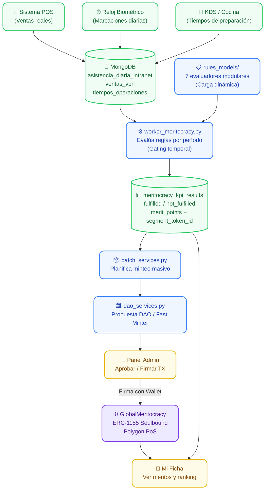

# 🎮 Meritocracia On-Chain: Soulbound Tokens para Evaluación de Desempeño

## ¿Qué es esto?

Un sistema de **evaluación de empleados basado en Soulbound Tokens (SBTs)**. Los KPIs laborales reales (ventas, asistencia, tiempos operacionales) se miden automáticamente, se evalúan con reglas configurables, y los resultados se acuñan como **tokens inmutables en Polygon PoS** vinculados a la wallet del empleado.

No es un sistema de puntos en una base de datos. Los méritos existen on-chain, son verificables públicamente y no pueden ser falsificados ni eliminados por un administrador.

---

## 📐 Diagrama de Flujo Completo



---

## 🧠 El Worker de Meritocracia (`worker_meritocracy.py`)

Este es el corazón del sistema. Es un proceso batch que se ejecuta periódicamente (fin de mes) y evalúa a **todos los empleados activos** contra **todas las reglas activas**.

### El Ciclo de Evaluación

1. **Carga Dinámica de Evaluadores:** Escanea `config/gamification/rules_models/` y descubre automáticamente todos los archivos `*.py` que exporten `TEMPLATE_KEY` y `evaluate()`. No necesitas registrar nada manualmente.

2. **Resolución de Empleados Elegibles:** Cruza `trabajadores_vpn` (ficha laboral) con `empleados_usuarios` (wallet Web3) y filtra solo los activos que tengan asistencia registrada en el período.

3. **Gating Temporal (Anti-Fraude):**
   - Reglas **mensuales**: Solo se evalúan cuando el mes está cerrado (`is_month_finalized`). Mientras el mes esté abierto, el status queda como `not_eligible_yet`.
   - Reglas **anuales**: Solo se evalúan cuando el año cerró, y se computan exclusivamente en diciembre.
   - Esto impide que alguien manipule datos antes del cierre.

4. **Filtrado por Scope (Sección/Cargo):** Cada regla puede definir inclusiones y exclusiones por sección (ej: "Solo Cocina") o por cargo (ej: "Solo Garzones"). El scope se resuelve cruzando la asistencia real del período, no la ficha estática.

5. **Evaluación y Resultados:** Cada evaluador recibe la base de datos, la regla y el período. Retorna una lista de RUTs ganadores. El worker genera documentos `fulfilled` o `not_fulfilled` con `merit_points` y `segment_token_id` para cada empleado.

---

## 📋 Los 7 Evaluadores de KPI (`rules_models/`)

Cada archivo es un evaluador independiente que el worker descubre dinámicamente:

| Evaluador | TEMPLATE_KEY | Qué Mide |
|-----------|-------------|----------|
| `sales_ranking.py` | Ranking de ventas | Top N vendedores del período por monto total |
| `admin_sales_ranking.py` | Ranking admin ventas | Variante administrativa con cortes por sucursal |
| `sales_top_category.py` | Top categoría ventas | Vendedor #1 en una categoría específica (ej: Pizzas) |
| `admin_sales_top_category.py` | Top categoría admin | Variante admin con filtros adicionales |
| `assistance.py` | Asistencia perfecta | Empleados con 0 inasistencias en el período |
| `times_metrics_employee.py` | Tiempos por empleado | Métricas de velocidad operacional individual |
| `times_metrics_local.py` | Tiempos por local | Métricas de velocidad operacional por sucursal |

### Cómo Crear un Nuevo Evaluador

1. Crea un archivo en `config/gamification/rules_models/` (ej: `delivery_performance.py`).
2. Exporta `TEMPLATE_KEY = "delivery_performance"`.
3. Exporta una función `evaluate(db, rule, periodo_dash) -> List[str]` que retorne los RUTs ganadores.
4. **Listo.** El worker lo descubrirá automáticamente en la siguiente ejecución.

---

## ⛓️ Del Resultado al Token (Flujo On-Chain)

Una vez que el worker genera los resultados (`meritocracy_kpi_results`), comienza la fase de tokenización:

### 1. Planificación (`batch_services.py`)
```python
# El admin solicita el plan de minteo del mes
plan = await plan_batch_merit({"ym": "2026-04", "employees": [...]})
# Retorna: cuántos tokens le tocan a cada wallet según sus merit_points
```

### 2. Construcción de TX (`dao_services.py`)
Dos caminos posibles:
- **Vía DAO:** Se crea una propuesta en `VanellixDAOController`. Los socios votan. Si se aprueba, se ejecuta el minteo.
- **Vía Fast Minter:** Una wallet designada (`SimpleWalletMinting`) puede mintear directamente sin votación (para operaciones mensuales rutinarias).

### 3. Firma y Ejecución
El backend **nunca** custodia llaves privadas de administradores. Construye el JSON de la transacción y se lo envía al Frontend. El Admin firma con su Wallet (Privy embedded) y la TX se envía a Polygon.

### 4. Sellado (`mark_merits_as_minted`)
Una vez confirmada la TX on-chain, los resultados se marcan como `minted: true` en MongoDB. Esto es **irreversible**: no se pueden recalcular ni revertir los méritos ya emitidos.

---

## 🔗 Contratos Involucrados

| Contrato | Dirección | Rol en Meritocracia |
|----------|-----------|---------------------|
| `GlobalMeritocracy` | `0xe75e...AaaC` | Almacena y emite los tokens de mérito (ERC-1155 Soulbound) |
| `VanellixDAOController` | `0x7AbD...581c` | Gobernanza: aprueba propuestas de minteo masivo |
| `SimpleWalletMinting` | `0x38fF...CB5b` | Fast Minter: minteo directo sin votación DAO |
| `VanellixCompanyMultiToken` | `0x5A21...7de9` | Define los segmentos de tokens (Venta, Asistencia, etc.) |

---

## 🛠️ Ejecución del Worker

```bash
# Evaluar el mes anterior (por defecto)
python -m utils.kpis.worker_meritocracy

# Evaluar un mes específico
python -m utils.kpis.worker_meritocracy --periodo 202604

# Evaluar todo un año
python -m utils.kpis.worker_meritocracy --periodo 2025
```

---

## ⚠️ Reglas del Sistema
1. **Inmutabilidad Post-Minteo:** Una vez que `mark_merits_as_minted` se ejecuta, esos tokens existen para siempre on-chain. No se pueden borrar ni recalcular.
2. **Gating Temporal:** Nunca se evalúan períodos abiertos. El worker rechaza automáticamente meses que no han cerrado.
3. **Scope > Ficha:** El cargo/sección se resuelve desde la asistencia real del período, no desde la ficha estática del empleado. Esto evita que un cambio de cargo retroactivo altere resultados históricos.
4. **Todo pasa por `service.py`:** Las APIs nunca llaman directamente a `batch_services` ni a `dao_services`. Siempre a través del facade `config.gamification.service`.
